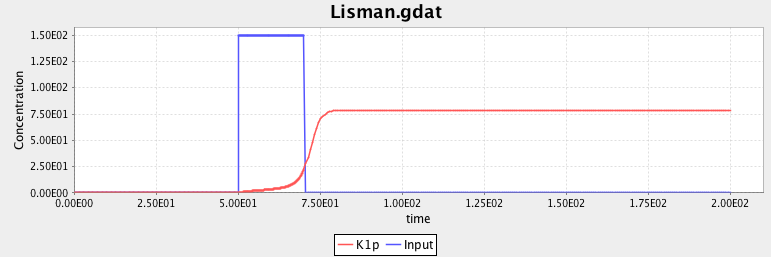
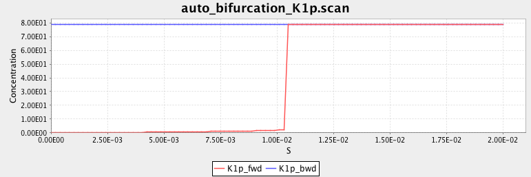

[`GK.bngl`](GK.bngl)
: Goldeter-Koshland model of simple phosphorylation cycle.

[`Lisman.bngl`](Lisman.bngl)
: Lisman model of autophosphorylating kinase. This model exhibits bistability, which can be seen by varying the strength and/or duration of an input signal, `S` in the model, to see if the system retains memory of the stimulation or relaxes back to its initial state. The model demonstrates the use of the `setParameter` command to change the value of a model parameter at a particular point in time. It also demonstrates the use of trajectory continuation through the use of the `continue=>1` option to `simulate`. A continued trajectory resumes simulation at the point where the last simulation ended and appends further output to a single output file. RuleBender will display the trajectory generated by a series of continued `simulate` commands in a single plot, as shown here.

[`Lisman_bifurcate.bngl`](Lisman_bifurcate.bngl)
: Bifurcation analysis of the Lisman model of autophosphorylating kinase using the `bifurcate` command in BNGL. Starting from an inactive state, the input parameter `S` is scanned up to a maximum value and then back down to the initial value. The input concentrations for each simulation are taken from the final (steady state) values of the previous simulation. Because the scan starts in a region of bistability and passes above the bifurcation point, the switching to the upper steady state is irreversible.

